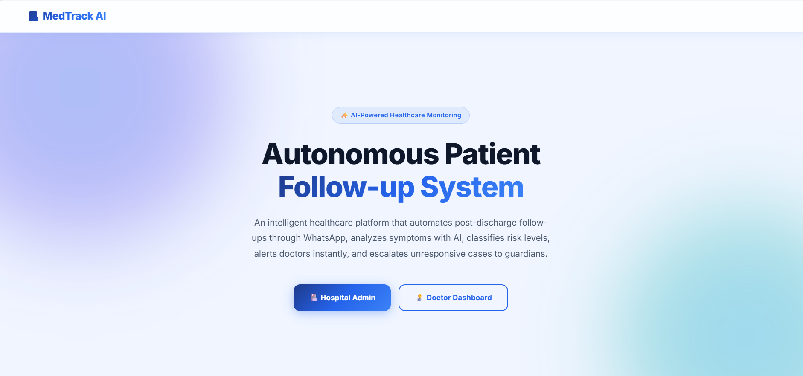
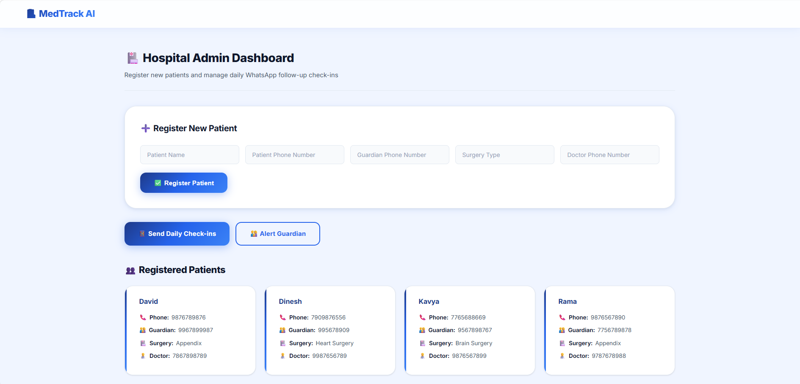
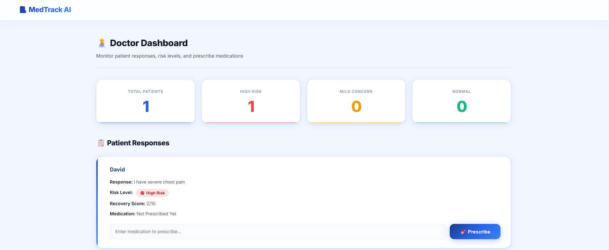
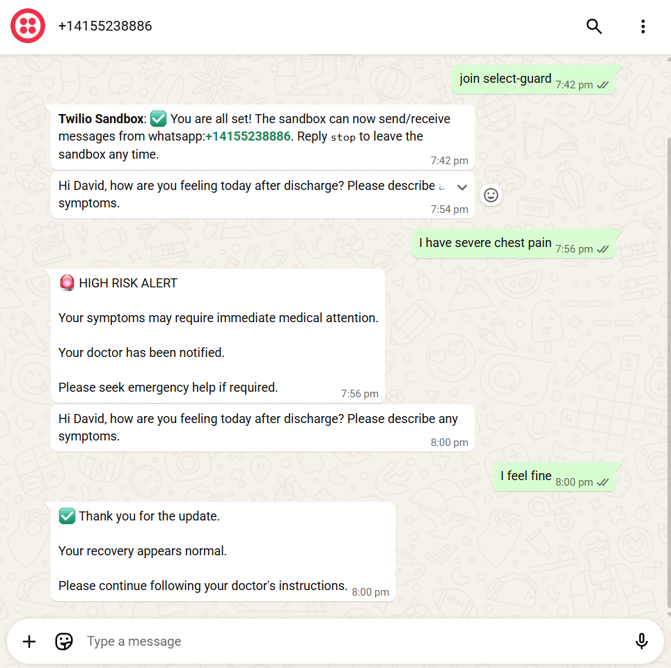
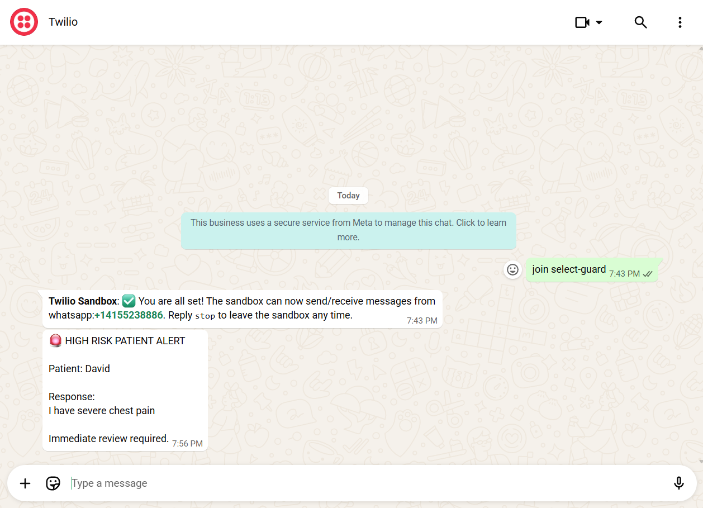
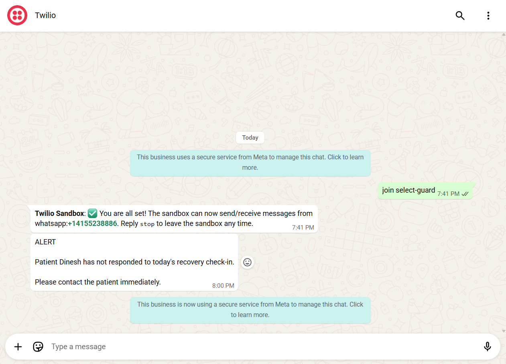

# Autonomous Patient Follow-up Agent

A healthcare automation system that monitors post-discharge patients through WhatsApp using Flask, SQLite, and Twilio APIs.

## Features

- Patient Registration
- Automated WhatsApp Check-ins
- Symptom-Based Risk Analysis
- Doctor Dashboard
- Medication Tracking
- Guardian Escalation Alerts

## Tech Stack

- Python
- Flask
- SQLite
- Twilio WhatsApp API
- HTML
- CSS

## Screenshots

### Home Page


### Admin Dashboard


### Doctor Dashboard


### Patient Follow-up


### High Risk Alert


### Guardian Alert


## Installation

```bash
pip install -r requirements.txt
python app.py